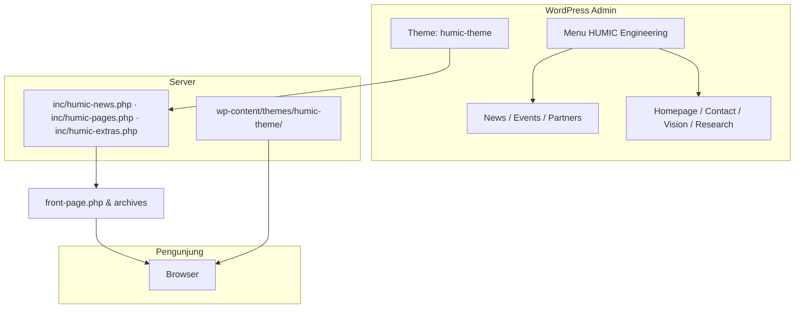
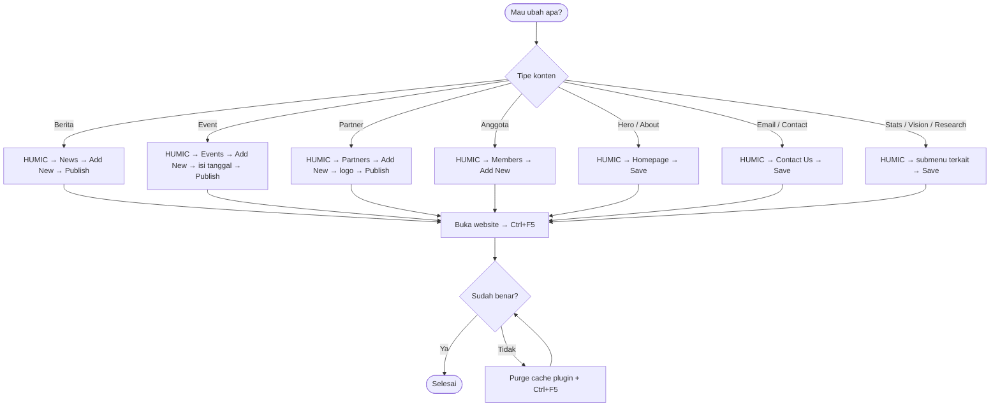
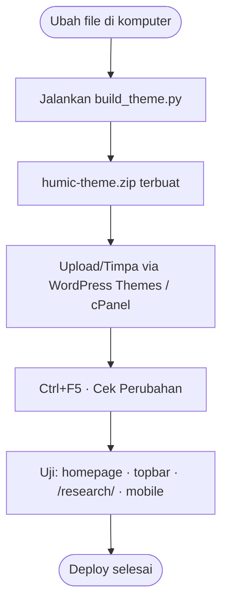
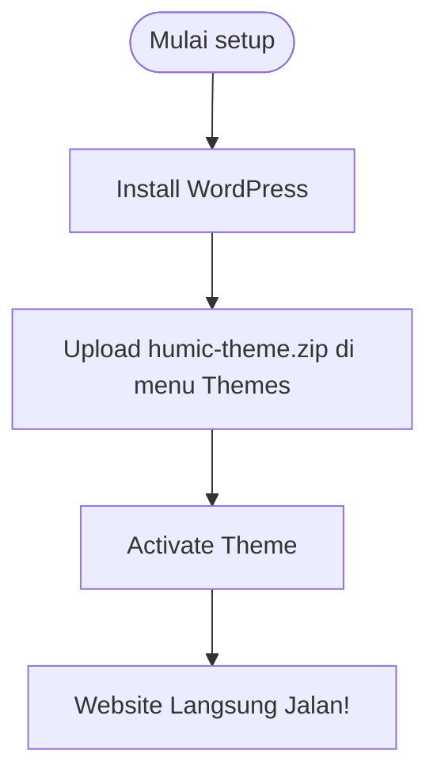

# HUMIC Engineering — Website Project


**A Custom WordPress Architecture developed from scratch to bypass standard builder limitations, featuring a proprietary PHP engine, modern CSS animations, and highly optimized DOM manipulation.**

## 💡 Intellectual Property & Authorship
This repository contains the source code for the custom architecture of the HUMIC Engineering website. 
Developed by **Dhimmas** (2026), this system is built entirely from scratch comprising over **9,600+ Lines of Code (LOC)**:
- **PHP Engine (~4,800+ LOC)**: A proprietary WPCode-based engine handling Custom Post Types, Meta Boxes, and Data Models.
- **CSS Styling (~3,800+ LOC)**: Exclusive, highly optimized UI system with custom animations and responsive layouts.
- **JavaScript (~1,000+ LOC)**: Interactive DOM logic and real-time sticky header manipulation.

*Property of HUMIC Research Center - Telkom University.*

---

> **Untuk siapa dokumen ini?**
> Dokumen ini adalah **User Manual & Developer Guide** untuk orang yang akan me-*maintain* atau mengambil alih operasional website. Panduan ini mencakup: gambaran project, setup dari nol, maintenance konten harian, deploy file ke server, dan troubleshooting.

**Versi asset saat ini:** `1.4.3` (`HUMIC_ASSET_VERSION` di `humic-news.php`)

---

## Daftar Isi

- [Mulai dari Sini (Quick Start)](#mulai-dari-sini-quick-start)
- [Diagram Alur](#diagram-alur)

**Pengenalan & Konsep**
1. [Gambaran Umum](#1-gambaran-umum)
2. [Istilah Penting (Glosarium)](#2-istilah-penting-glosarium)
3. [Apa Saja yang Dibutuhkan?](#3-apa-saja-yang-dibutuhkan)
4. [Struktur File di Folder Project](#4-struktur-file-di-folder-project)

**Setup Awal**
5. [Setup Awal — Langkah demi Langkah](#5-setup-awal--langkah-demi-langkah)
6. [Membuat Homepage (3 Blok Terpisah)](#6-membuat-homepage-3-blok-terpisah)

**Navigasi & Halaman**
7. [Navigasi Menu Admin WordPress](#7-navigasi-menu-admin-wordpress)
8. [Peta Halaman Website](#8-peta-halaman-website)

**Maintenance Harian**
9. [Maintenance Rutin — Panduan Harian/Mingguan](#9-maintenance-rutin--panduan-harianmingguan)
10. [Cara Edit Konten — Detail per Jenis](#10-cara-edit-konten--detail-per-jenis)
11. [Daftar Shortcode (Referensi)](#11-daftar-shortcode-referensi)

**Deploy & Update**
12. [Kapan Perlu Deploy?](#12-kapan-perlu-deploy)
13. [Deploy CSS / JS](#13-deploy-css--js)
14. [Deploy Snippet PHP (WPCode)](#14-deploy-snippet-php-wpcode)
15. [Deploy Lengkap (Semua File)](#15-deploy-lengkap-semua-file)
16. [Deploy Khusus Header / Topbar Merah](#16-deploy-khusus-header--topbar-merah)
17. [Cek Versi Asset Sudah Ke-load](#17-cek-versi-asset-sudah-ke-load)
18. [Bump Versi Manual](#18-bump-versi-manual)
19. [Upload Gambar & Asset](#19-upload-gambar--asset)

**Testing & Troubleshooting**
20. [Testing Setelah Deploy](#20-testing-setelah-deploy)
21. [Cache — Jika Perubahan Tidak Muncul](#21-cache--jika-perubahan-tidak-muncul)
22. [Troubleshooting — Masalah Umum](#22-troubleshooting--masalah-umum)
23. [Rollback Cepat](#23-rollback-cepat)

**Referensi**
24. [Yang Jangan Diubah Sembarangan](#24-yang-jangan-diubah-sembarangan)
25. [Checklist Serah Terima](#25-checklist-serah-terima)
26. [FAQ](#26-faq)
27. [Riwayat Versi (Changelog)](#27-riwayat-versi-changelog)
28. [Quick Reference Card](#28-quick-reference-card)

---

## 🚀 Instalasi Cepat via Theme (Sangat Direkomendasikan)
Jika Anda ingin memasang sistem arsitektur ini di website WordPress baru, Anda **TIDAK PERLU** melakukan setup *coding* manual atau meng-*install* plugin WPCode. 

Gunakan file **`humic-theme.zip`** yang sudah tersedia di *repository* ini!

1. Buka WordPress Dashboard Anda.
2. Masuk ke menu **Appearance > Themes > Add New > Upload Theme**.
3. Pilih file `humic-theme.zip` dan klik **Install Now**.
4. Klik **Activate**.

> [!SUCCESS]
> **Selesai!** Seluruh arsitektur *Custom Post Type* (News, Events, IPR, dll), desain antarmuka (CSS), animasi, dan logika website akan langsung terpasang dan berjalan secara otomatis. Anda siap menggunakan sistem ini!

---

## Mulai dari Sini (Panduan Lanjutan)

| Situasi Anda | Baca bagian ini |
|---|---|
| **Baru terima project**, belum setup | [§5 Setup Awal](#5-setup-awal--langkah-demi-langkah) → [§6 Homepage 3 Blok](#6-membuat-homepage-3-blok-terpisah) → [§25 Checklist Serah Terima](#25-checklist-serah-terima) |
| **Mau tambah berita / event / partner** | [§9 Maintenance Rutin](#9-maintenance-rutin--panduan-harianmingguan) → [§10 Edit Konten](#10-cara-edit-konten--detail-per-jenis) |
| **Mau ganti teks hero, contact, email** | [§7 Menu Admin](#7-navigasi-menu-admin-wordpress) → [§10.E–I](#e-mengedit-hero--about-homepage) |
| **Mau upload CSS/JS/PHP ke server** | [§12 Kapan Perlu Deploy?](#12-kapan-perlu-deploy) → [§13–§15 Deploy](#13-deploy-css--js) |
| **Topbar merah hilang / homepage kosong** | [§22 Troubleshooting](#22-troubleshooting--masalah-umum) |
| **Judul Page muncul di website** | [§6 — Nama Page](#nama-page-homepage--judul-di-admin) + [§22 Troubleshooting](#judul-page-wordpress-muncul-di-homepage) |
| **Bingung istilah WordPress** | [§2 Glosarium](#2-istilah-penting-glosarium) |
| **Mau lihat gambaran visual** | [Diagram Alur](#diagram-alur) |

---

## Diagram Alur

Diagram di bawah membantu memahami **cara website jalan**, **flow harian admin**, **deploy**, dan **struktur homepage**.
*(Viewer Markdown yang mendukung Mermaid — mis. GitHub, VS Code, Cursor — akan merender diagram otomatis.)*

### A. Arsitektur website (big picture)



### B. Flow harian — edit konten (tanpa coding)



### C. Flow deploy — ubah file project



### D. Flow setup awal (serah terima / hosting baru)



## 1. Gambaran Umum

Website **HUMIC Engineering** dibangun dengan **WordPress**. Tampilan khas HUMIC (header merah, homepage, halaman Research, dll.) dirender sepenuhnya oleh **Custom Standalone Theme**.

| Komponen | Penjelasan sederhana |
|---|---|
| **Theme `humic-theme`** | Tema WordPress kustom yang berisi seluruh logika, CPT, tampilan, dan integrasi front-end. |
| **`front-page.php`** | File di dalam tema yang langsung merender seluruh isi landing page otomatis tanpa butuh builder tambahan. |

### Apa yang bisa dilakukan tanpa coding?

- Tambah/edit **berita**, **event**, **partner**, **anggota tim**, **media**
- Ubah teks/gambar **Hero**, **About**, **Stats**, **Contact**, **Vision & Mission**, **Research**
- Ganti email, alamat, link sosial media
- Upload logo partner, foto anggota, gambar hero

### Menu admin HUMIC

Website menggunakan beberapa menu khusus di WordPress Admin:

- **HUMIC Engineering → Homepage** / **Homepage Stats** / **Navigation Menu** / **Contact Us** / **Research Areas** / **Vision & Mission**
- **HUMIC News** / **HUMIC Events** / **HUMIC Members** / **HUMIC Partners** / **HUMIC IPR** / **HUMIC in Media**

Sebagian besar perubahan konten dilakukan melalui menu-menu tersebut.

---

## 2. Istilah Penting (Glosarium)

| Istilah | Artinya |
|---|---|
| **WordPress / WP** | Platform website. Area admin: `yoursite.com/wp-admin` |
| **Page (Halaman)** | Halaman statis, mis. Homepage |
| **Post / CPT** | Jenis konten khusus: News, Events, Members, dll. |
| **Shortcode** | Kode dalam kurung siku, mis. `[humic_hero]` — WordPress otomatis render jadi tampilan |
| **WPCode** | Plugin untuk menjalankan kode PHP custom |
| **Snippet** | Potongan kode di WPCode |
| **wp-content/uploads/** | Folder file upload WordPress di server |
| **Hard refresh** | Muat ulang halaman tanpa cache: `Ctrl + F5` (Windows) / `Cmd + Shift + R` (Mac) |
| **Permalink** | Format URL website (Settings → Permalinks) |
| **Featured Image** | Gambar utama sebuah post (thumbnail) |
| **CPT** | Custom Post Type — tipe konten buatan (News, Events, dll.) |

---

## 3. Apa Saja yang Dibutuhkan?

### Akses yang harus dimiliki

- [ ] Login **wp-admin** (username & password)
- [ ] Akses **hosting panel** (cPanel, Plesk, dll.) **atau** FTP
- [ ] Folder project lokal (file `.php`, `.css`, `.js`, `.html` referensi)
- [ ] (Opsional) Akses plugin **WPCode** di admin

### Plugin WordPress

| Plugin | Wajib? | Fungsi |
|---|---|---|
| **WPCode** | **Ya** | Menjalankan 3 file PHP project ini |
| Cache plugin (LiteSpeed, WP Rocket, dll.) | Opsional | Bisa bikin perubahan CSS tidak langsung kelihatan — perlu di-purge |

**Catatan:** Project ini **tidak memakai Elementor**. Homepage diedit lewat **Pages → Edit** (Block Editor atau Classic Editor).

---

## 4. Struktur File di Folder Project

Folder project berisi file berikut. **Tidak semua di-upload ke server.**

### File yang di-deploy ke server

| File | Tujuan di server | Cara deploy |
|---|---|---|
| `humic-news.php` | WPCode → snippet **HUMIC News & Layout** | Copy-paste seluruh isi → Save |
| `humic-pages.php` | WPCode → snippet **HUMIC Pages** | Copy-paste seluruh isi → Save |
| `humic-extras.php` | WPCode → snippet **HUMIC Extras** | Copy-paste seluruh isi → Save |
| `style.css` | `wp-content/uploads/humic/style.css` | File Manager / FTP — timpa file lama |
| `script.js` | `wp-content/uploads/humic/script.js` | File Manager / FTP — timpa file lama |

### File referensi (TIDAK di-upload ke server)

| File | Fungsi |
|---|---|
| `index.html` | Gabungan lengkap homepage (referensi) |
| `index-widget-header.html` | Contoh blok 1 homepage |
| `index-widget-main.html` | Contoh blok 2 homepage |
| `index-widget-footer.html` | Contoh blok 3 homepage |
| `README.md` | Panduan ini |

### Di server, file hidup di:

```
wp-content/
  uploads/
    humic/
      style.css          ← styling
      script.js          ← interaksi
      image-22.png       ← logo (contoh)
      image-4.png        ← ilustrasi (contoh)
      ...                ← gambar lain
```

---

## 5. Setup Awal (Otomatis via Theme)

Sistem terbaru menggunakan standalone theme humic-theme. Anda tidak perlu menggunakan WPCode atau Elementor.

### Langkah 1 — Upload Theme

1. Login ke WordPress admin.
2. Buka **Appearance → Themes → Add New → Upload Theme**.
3. Upload humic-theme.zip.
4. Klik **Install Now** dan **Activate**.

### Langkah 2 — Atur Permalink

1. Buka **Settings → Permalinks**.
2. Pilih **Post name** (recommended).
3. Klik **Save Changes** (penting agar /research/, /news/, dll tidak error 404).

### Langkah 3 — Verifikasi

Buka halaman utama website. Homepage dengan seluruh block (Hero, Stats, About, News, Events, Partners, Contact) akan langsung ter-render dengan sempurna secara otomatis tanpa perlu membuat Page baru.

---

## 7. Navigasi Menu Admin WordPress

Setelah snippet aktif, di sidebar admin muncul menu **HUMIC Engineering**.

### Submenu — untuk edit apa?

| Klik menu ini… | Untuk mengubah… | Muncul di website… |
|---|---|---|
| **News** | Artikel/berita | Homepage (3 terbaru) + halaman `/news/` |
| **Events** | Kegiatan/event | Homepage (upcoming) + halaman `/events/` |
| **Partners** | Logo mitra | Section Partners di homepage |
| **Members** | Profil tim | Halaman `/members/` |
| **Media** | Galeri media | Halaman `/media/` |
| **Homepage** | Teks & gambar Hero + About | Bagian atas homepage |
| **Homepage Stats** | Angka statistik (100+, dll.) | Bar merah statistik |
| **Navigation Menu** | Menu header & footer Quick Links | Header + footer |
| **Vision & Mission** | Teks vision/mission + timeline | Homepage (ringkas) + `/vision-mission/` |
| **Research Areas** | Kartu research + detail accordion | Homepage + `/research/` |
| **Contact Us** | Alamat, email, maps, QR, sosmed | Contact homepage + header + footer |

### Mengubah Menu Header & Quick Links Footer

Buka: **WordPress Admin → HUMIC Engineering → Navigation Menu**

Footer **Quick Links** otomatis mengikuti isi Navigation Menu.

#### Format Penulisan Menu

```text
Label | URL
```

Contoh:

```text
Home | {home}
News | {news}
Events | {events}
```

#### Membuat Dropdown / Submenu

Beri indentasi dengan spasi atau tab:

```text
About Us
  Vision & Mission | {vision}
  Members | {members}
```

#### Membuka Link di Tab Baru

Tambahkan `| external` di akhir baris:

```text
Catalog Products | {catalog} | external
```

#### Token URL Otomatis

| Token | Tujuan |
|---|---|
| `{home}` | Homepage |
| `{vision}` | Vision & Mission |
| `{members}` | Members |
| `{research}` | Research Areas |
| `{catalog}` | Catalog Products |
| `{ipr}` | Intellectual Property Rights |
| `{media}` | HUMIC in Media |
| `{news}` | News archive |
| `{events}` | Events archive |
| `{partners}` | Section partners di homepage |
| `{contact}` | Section contact di homepage |

### Tips navigasi admin

- Setelah klik **Save Changes** di halaman setting, buka website dan **Ctrl+F5** untuk lihat perubahan
- Jika tidak yakin menu mana, cek kolom "Muncul di website" di tabel atas
- Untuk konten berbentuk "artikel" (News, Events) → pakai **Add New** seperti blog biasa

---

## 8. Peta Halaman Website

### Halaman utama

| URL | Jenis | Cara edit konten |
|---|---|---|
| `/` (homepage) | WordPress Page + shortcode | Admin HUMIC + edit Page (struktur HTML) |
| `/news/` | Arsip otomatis | HUMIC → News |
| `/news/judul-artikel/` | Single news | Edit post News |
| `/events/` | Arsip otomatis | HUMIC → Events |
| `/members/` | Arsip otomatis | HUMIC → Members |
| `/media/` | Arsip otomatis | HUMIC → Media |

### Halaman virtual (tidak ada di menu Pages)

Halaman ini **dibuat otomatis oleh kode PHP**, bukan Page WordPress biasa:

| URL | Isi | Edit via admin |
|---|---|---|
| `/vision-mission/` | Vision & Mission lengkap | HUMIC → Vision & Mission |
| `/research/` | Research areas + accordion | HUMIC → Research Areas |
| `/ipr/` | Intellectual Property Rights | File `humic-pages.php` (butuh developer) |

### Link eksternal

| Menu / tombol | URL default | Cara ubah |
|---|---|---|
| Catalog Products | URL di admin Research Areas | HUMIC → Research Areas → Catalog Products URL |
| Dokumen IPR | Google Docs (hardcoded) | Edit snippet `humic-pages.php` |

### Anchor di homepage

| Link menu | Target |
|---|---|
| Partners | `/#partners` (scroll ke section partners) |
| Contact | `/#contact` |

---

## 9. Maintenance Rutin — Panduan Harian/Mingguan

### Setiap ada konten baru (harian / sesuai kebutuhan)

| Tugas | Langkah singkat | Estimasi |
|---|---|---|
| **Tambah berita** | HUMIC → News → Add New → Publish | 5–15 menit |
| **Tambah event** | HUMIC → Events → Add New → isi tanggal → Publish | 5–10 menit |
| **Tambah partner** | HUMIC → Partners → Add New → upload logo → Publish | 3 menit |
| **Update anggota tim** | HUMIC → Members → edit post | 5 menit |

### Mingguan / bulanan

| Tugas | Langkah |
|---|---|
| Cek homepage tampil normal | Buka `/` di HP + desktop |
| Cek event lama | Event yang sudah lewat otomatis pindah ke arsip |
| Backup | Backup database + folder `uploads/humic/` via hosting |
| Review link sosmed | HUMIC → Contact Us → Footer & Social Media |

### Hanya jika ada perubahan desain/kode

| Tugas | File | Lihat bagian |
|---|---|---|
| Ubah warna/layout | `style.css` | [§13](#13-deploy-css--js) |
| Ubah menu mobile / sticky header | `script.js` | [§13](#13-deploy-css--js) |
| Ubah fitur PHP | Snippet WPCode | [§14](#14-deploy-snippet-php-wpcode) |

---

## 10. Cara Edit Konten — Detail per Jenis

---

### A. Menambah Berita (News)

**Tampil di:** homepage (maks. 3 terbaru) + `/news/`

1. Login wp-admin
2. **HUMIC Engineering → News → Add New**
3. Isi **Title** (judul berita)
4. Isi **Content** (isi artikel — opsional jika pakai link eksternal)
5. Di sidebar kanan, klik **Set featured image** → upload/pilih gambar thumbnail
6. Di sidebar kanan juga, temukan box **News Details** (sekarang sejajar dengan Featured Image):

  | Field | Contoh | Keterangan |
  |---|---|---|
  | **Category label** | `Conference` | Pilih dari Dropdown (tersedia opsi "+ Add New Category..." jika butuh custom label) |
  | **Display date** | `Nov 2024` | Tanggal tampilan (bebas format) |
  | **Link URL** | `https://...` | Tujuan tombol "Read More" |
  | **Featured** | centang | Prioritas tampil (jika ada) |

7. Klik **Publish**
8. Buka homepage → section Latest News → artikel baru harus muncul
9. Jika tidak muncul: **Ctrl+F5**, pastikan status **Published** (bukan Draft)

---

### B. Menambah Event

**Tampil di:** homepage (event **mendatang** saja) + `/events/`

1. **HUMIC Engineering → Events → Add New**
2. Isi **Title** (nama event)
3. Isi **Excerpt** (ringkasan singkat — tampil di kartu)
4. Di box **Event Details**:

  | Field | Wajib? | Contoh |
  |---|---|---|
  | **Event date** | **Ya** | `2026-06-15` (format kalender) — untuk sorting |
  | **Display label** | Tidak | `15 June 2026` — teks yang dilihat pengunjung |

5. **Publish**

**Penting:** Event dengan tanggal **sudah lewat** tidak muncul di homepage (`[humic_events_home]`), tapi tetap ada di arsip `/events/`.

---

### C. Menambah Partner

**Tampil di:** section Partners homepage

1. **HUMIC Engineering → Partners → Add New**
2. **Title** = nama partner (untuk admin, bisa nama perusahaan)
3. **Featured image** = **logo partner** (PNG transparan recommended)
4. **Publish**

**Urutan logo:** Atur lewat **Page Attributes → Order** (angka kecil = tampil lebih dulu) atau tanggal publish.

---

### D. Menambah Anggota Tim (Members)

**Tampil di:** `/members/`

1. **HUMIC Engineering → Members → Add New**
2. **Title** = nama lengkap
3. **Featured image** = foto profil
4. Box **Member Details**:

  | Field | Keterangan |
  |---|---|
  | **Group** | Head of Research Center / Officer / Researcher |
  | **Position label** | Mis. `Administrative`, `Finance` |
  | **Social links** | LinkedIn, Twitter/X, Facebook, Google Scholar — ditampilkan di card semua tipe member |

5. Untuk Head: isi **biography** di editor konten utama
6. **Publish**

---

### E. Mengedit Hero & About (Homepage)

**Tidak perlu edit HTML homepage** — cukup admin:

1. **HUMIC Engineering → Homepage**

#### Hero Section

| Field | Contoh |
|---|---|
| Label | `Welcome to` |
| Title | `HUMIC Engineering` |
| Highlighted Word | `Engineering` (muncul merah) |
| Description | Paragraf intro |
| Primary Button | Teks + URL (kosong = link ke Vision) |
| Secondary Button | Teks + URL (bisa `#contact`) |
| Background Image | Klik Select → pilih dari Media Library |

#### About Section

| Field | Contoh |
|---|---|
| Eyebrow | `About Us` |
| Title | `Who We Are` |
| Badge year / label | Tahun + label |
| Photo / Logo | Upload via Media Library |

2. Klik **Save Changes**
3. Refresh homepage (**Ctrl+F5**)

---

### F. Mengedit Statistik (Bar Angka Merah)

1. **HUMIC Engineering → Homepage Stats**
2. Isi 3 baris **Value** + **Label**, contoh:

  | Value | Label |
  |---|---|
  | `100+` | `Research Projects` |
  | `50+` | `Partners` |
  | `10+` | `Years Experience` |

3. **Save Changes**

---

### G. Mengedit Vision & Mission

1. **HUMIC Engineering → Vision & Mission**
2. Isi:
  - **Vision** — paragraf vision
  - **Mission summary** — ringkasan di homepage (section About)
  - **Mission items** — satu poin per baris
  - **Timeline image** — klik **Select image** → upload grafis timeline
3. **Save Changes**
4. Cek di `/vision-mission/`

---

### H. Mengedit Research Areas

1. **HUMIC Engineering → Research Areas**
2. Bagian atas:
  - **Research Page Intro** — teks pembuka halaman `/research/`
  - **Catalog Products URL** — link menu Catalog di header
3. Tabel **Research Cards** — setiap baris = satu kartu:

  | Kolom | Fungsi |
  |---|---|
  | Num | Angka urutan (01, 02, …) |
  | Icon | Class Font Awesome, mis. `fa-solid fa-flask` |
  | Slug | ID untuk accordion, mis. `hydrology` |
  | Title | Judul research |
  | Desc | Deskripsi singkat (homepage) |
  | Detail | Teks panjang (halaman `/research/` accordion) |

4. **Save Changes**

---

### I. Mengedit Contact, Email & Sosmed

1. **HUMIC Engineering → Contact Us**

#### Office Location
- Alamat, telepon, email, link Google Maps, teks tombol

#### Keluhan (QR)
- Heading, label, URL form keluhan, upload **QR code**

#### Footer & Social Media
- Link Facebook, Instagram, LinkedIn, YouTube

**Email di sini juga dipakai di topbar merah header** — ubah sekali, update di banyak tempat.

2. **Save Changes**

---

### J. Mengelola Intellectual Property Rights (IPR)

**WordPress Admin → HUMIC IPR**

Field penting:
- **Title** — nama item IPR
- **Content** — detail item
- **Category** — tipe IPR: Paten / Paten Sederhana / HKI

Klik **Publish** atau **Update**.

---

### K. Mengelola HUMIC in Media

**WordPress Admin → HUMIC in Media**

Field penting:
- **Title** — judul media
- **Content** — deskripsi
- **YouTube URL or embed ID** — link YouTube atau ID video

Klik **Publish**.

---

## 11. Daftar Shortcode (Referensi)

Shortcode = kode dalam `[kurung]` yang WordPress ubah jadi tampilan.

### Layout

| Shortcode | Fungsi |
|---|---|
| `[humic_header active="home"]` | Header lengkap. Ganti `home` dengan `news`, `events`, `research` di halaman lain jika perlu |
| `[humic_footer]` | Footer situs |

### Section homepage

| Shortcode | Fungsi |
|---|---|
| `[humic_hero]` | Banner hero |
| `[humic_stats_bar]` | Bar statistik |
| `[humic_about]` | Section about |
| `[humic_research_areas]` | Kartu research |
| `[humic_news]` | Grid berita |
| `[humic_events_home]` | Event mendatang |
| `[humic_partners]` | Logo partner |
| `[humic_contact_office]` | Kotak alamat kantor |
| `[humic_contact_keluhan]` | Kotak keluhan + QR |

### Link otomatis (pakai di atribut `href`)

| Shortcode | Menjadi link ke… |
|---|---|
| `[humic_news_url]` | `/news/` |
| `[humic_events_url]` | `/events/` |
| `[humic_vision_url]` | `/vision-mission/` |
| `[humic_research_url]` | `/research/` |
| `[humic_members_url]` | `/members/` |
| `[humic_media_url]` | `/media/` |
| `[humic_ipr_url]` | `/ipr/` |
| `[humic_catalog_url]` | Katalog eksternal |
| `[humic_maps_url]` | Google Maps kantor |
| `[humic_home_url]` | Homepage |

### Lainnya

| Shortcode | Fungsi |
|---|---|
| `[humic_events]` | Daftar event (halaman events penuh) |
| `[humic_asset file="image-22.png"]` | URL gambar dari folder uploads/humic |

---

## 12. Deploy & Update Theme

Karena website ini menggunakan Standalone Theme, proses update sangat mudah. Kapan Anda perlu melakukan deploy?

1. Jika Anda mengubah desain (CSS) di file style.css.
2. Jika Anda mengubah interaksi / menu mobile di file script.js.
3. Jika Anda mengubah logika sistem di dalam file PHP mana pun (humic-news.php, humic-pages.php, dll).

### Cara Deploy Otomatis (Lokal)

Jika Anda sedang men-develop di lokal:
1. Jalankan python build_theme.py di terminal.
2. Script ini akan merakit semua file ke dalam folder humic-theme dan membungkusnya menjadi humic-theme.zip.
3. Copy folder humic-theme tersebut dan timpa (overwrite) isi folder wp-content/themes/humic-theme di XAMPP/server lokal Anda.

### Cara Deploy ke Hosting Server

1. Pastikan Anda sudah menjalankan python build_theme.py.
2. Login ke WordPress wp-admin di server.
3. Masuk ke **Appearance → Themes → Add New → Upload Theme**.
4. Upload humic-theme.zip.
5. WordPress akan bertanya apakah Anda ingin menimpa tema yang lama. Pilih **Replace current with uploaded**.
6. Selesai! Buka website dan tekan **Ctrl+F5** untuk melihat perubahan.

---

## 17. Cek Versi Asset Sudah Ke-load

Browser menyimpan cache. Pastikan file baru benar-benar dipakai:

1. Buka homepage
2. Tekan **F12** → tab **Network**
3. Refresh halaman (**Ctrl+F5**)
4. Cari `style.css` dan `script.js`

URL harus memuat query string, contoh:

```
style.css?ver=1.3.2.1739123456
script.js?ver=1.3.2.1739123456
```

| Bagian URL | Artinya |
|---|---|
| `1.3.2` | `HUMIC_ASSET_VERSION` di `humic-news.php` |
| `.1739123456` | Timestamp file saat di-upload (`filemtime`) — **berubah setiap upload** |

**Jika angka belakang tidak berubah** setelah upload → cache belum clear, atau file salah folder. Lihat [§21 Cache](#21-cache--jika-perubahan-tidak-muncul).

---

## 18. Bump Versi Manual

Gunakan saat deploy besar atau cache sangat agresif.

1. Buka `humic-news.php` lokal
2. Edit baris:

```php
define('HUMIC_ASSET_VERSION', '1.3.2');
```

3. Naikkan angka, mis. `'1.3.3'` atau `'1.4.0'`
4. Copy-paste seluruh file ke snippet WPCode **HUMIC News & Layout** → Save
5. Hard refresh + purge cache
6. Cek Network tab — prefix `?ver=` harus berubah ke versi baru

Versi otomatis = `HUMIC_ASSET_VERSION` + `.` + timestamp file. Bump manual memaksa semua browser ambil asset baru meski `filemtime` bermasalah.

---

## 19. Upload Gambar & Asset

### Gambar via Media Library (Hero, About, Timeline, QR)

- Dipakai di admin HUMIC (Homepage, Vision, Contact)
- Klik **Select image** → **Upload files** → pilih gambar → **Use this image**

### Gambar statis di folder `uploads/humic/`

- Logo header: `image-22.png`
- Ilustrasi about/research: `image-4.png`, `image-5.png`, dll.
- Upload via File Manager ke `wp-content/uploads/humic/`
- Referensi di kode: `[humic_asset file="nama-file.png"]`

### Rekomendasi format

| Jenis | Format | Ukuran kasar |
|---|---|---|
| Logo | PNG transparan | Lebar ~400px |
| Hero background | JPG/WebP | 1920×1080 atau lebih |
| Foto anggota | JPG | 400×400+ |
| Logo partner | PNG | Max height ~80px |
| QR code | PNG | 200×200+ |

---

## 20. Testing Setelah Deploy

Centang semua setelah setiap deploy CSS/JS/PHP:

### Homepage & layout

- [ ] **Homepage** — hero, stats, about, research, news, events, partners, contact **semua muncul**
- [ ] **Judul Page WordPress** (mis. "Homepage Humic") **tidak** muncul di bawah navbar
- [ ] **Topbar merah** (email + ikon sosial) tampil penuh, bukan garis tipis
- [ ] **Desktop sticky** — header menempel saat scroll ke bawah
- [ ] **Menu mobile** (HP / lebar < 768px) — burger buka/tutup smooth
- [ ] **Keyboard mobile menu** — Tab fokus di dalam menu, `Esc` menutup, fokus kembali ke burger

### Halaman lain

- [ ] **News** (`/news/`) — arsip tampil, menu OK, link aktif merah
- [ ] **Events** (`/events/`) — arsip tampil, menu OK
- [ ] **Members** (`/members/`) — daftar anggota OK
- [ ] **Media** (`/media/`) — galeri OK
- [ ] **Vision & Mission** (`/vision-mission/`)
- [ ] **Research** (`/research/`) — accordion buka/tutup
- [ ] **IPR** (`/ipr/`)

### Menu dropdown desktop

- [ ] Submenu **About Us** / **Research** / **Our Activity** — scroll internal jika konten panjang

### Login admin

- [ ] **Login sebagai admin** — header tidak tertutup admin bar WordPress
- [ ] Topbar merah tetap terlihat (~32px desktop, ~46px mobile)

### Regression — bug yang pernah terjadi

- [ ] Homepage **tidak kosong** di bawah header
- [ ] Mobile **bukan** mode sticky desktop (header tidak "nempel" aneh di HP)

---

## 21. Cache — Jika Perubahan Tidak Muncul

Ikuti urutan ini:

1. **Hard refresh** — `Ctrl+F5` (Windows) / `Cmd+Shift+R` (Mac)
2. Coba **mode incognito** / browser lain
3. **Purge cache plugin** — LiteSpeed Cache, WP Rocket, W3 Total Cache, dll.
4. **Purge CDN** — Cloudflare → Caching → Purge Everything
5. Cek **Network tab** — apakah `?ver=` berubah? ([§17](#17-cek-versi-asset-sudah-ke-load))
6. Pastikan file di folder **`uploads/humic/`**, bukan folder lain
7. **Bump versi** manual ([§18](#18-bump-versi-manual)) jika masih stuck

---

## 22. Troubleshooting — Masalah Umum

### Homepage kosong di bawah header

| Penyebab | Solusi |
|---|---|
| Header + main + footer dalam **1 blok** | Pisah jadi 3 blok ([§6](#6-membuat-homepage-3-blok-terpisah)) |
| Snippet WPCode nonaktif | Aktifkan ketiga snippet |
| Shortcode typo | Pastikan `[humic_hero]` dll. tertulis benar |

---

### Topbar merah tipis atau hilang

Gejala: hanya **garis merah tipis** di atas navbar, atau topbar tidak tampil sama sekali. Email dan ikon sosial tidak kelihatan.

| Penyebab | Solusi |
|---|---|
| File header **tidak selaras** (mis. CSS baru tapi PHP/JS lama) | Deploy **3 file sekaligus** ([§16](#16-deploy-khusus-header--topbar-merah)) |
| `style.css` / `script.js` / snippet belum di-update | Upload & paste ulang dari folder project versi **1.3.2** |
| Cache browser / plugin | **Ctrl+F5** + purge cache hosting |
| Login sebagai admin WordPress | Normal — versi **1.3.2** sudah perbaiki offset. **Uji juga saat logout** (mode incognito) |
| Versi lama masih ke-load | Cek Network tab: harus `style.css?ver=1.3.2.xxx`. Jika masih `1.3.1`, ulangi deploy + bump versi |

**Langkah perbaikan cepat (5 menit):**

1. Upload `style.css` + `script.js` ke `wp-content/uploads/humic/`
2. WPCode → **HUMIC News & Layout** → paste `humic-news.php` terbaru → Save
3. Ctrl+F5 di homepage **dan** `/research/`
4. Cek topbar: bar merah penuh + email + ikon sosial (login & logout admin)

---

### Judul Page WordPress muncul di homepage

Gejala: teks besar di bawah navbar, mis. **"Homepage Humic"** — bukan dari shortcode HUMIC, melainkan **theme WordPress** menampilkan Title Page.

| Penyebab | Solusi |
|---|---|
| `style.css` / `humic-news.php` belum versi terbaru | Upload `style.css` + paste `humic-news.php` ke WPCode |
| Cache | Ctrl+F5 + purge cache |
| CSS theme override | Pastikan snippet **HUMIC News & Layout** aktif (CSS kritis di `wp_head`) |

**Yang tidak perlu dilakukan:** mengosongkan Title Page di admin — nama internal tetap berguna untuk identifikasi.

---

### Menu mobile tidak bisa dibuka

1. Hard refresh (`Ctrl+F5`)
2. Pastikan `script.js` terbaru ada di `uploads/humic/`
3. Cek di HP / mode responsive browser (lebar < 768px)
4. Jangan edit `script.js` sembarangan — bagian mobile nav sensitif

---

### Perubahan CSS/JS tidak muncul

1. **Ctrl+F5**
2. Purge cache (LiteSpeed, WP Rocket, Cloudflare, dll.)
3. Cek Network tab — apakah `?ver=` berubah?
4. Bump `HUMIC_ASSET_VERSION` ([§18](#18-bump-versi-manual))

---

### Halaman `/research/` atau `/news/` error 404

1. **Settings → Permalinks → Save Changes**
2. Pastikan snippet WPCode aktif
3. Coba buka langsung: `domain.com/research/`

---

### Gambar broken (icon X)

1. Cek file ada di `wp-content/uploads/humic/`
2. Untuk Hero/About: pilih ulang di Media Library
3. Cek permission folder (biasanya 755)

---

### Menu HUMIC Engineering tidak muncul di admin

1. Pastikan snippet **HUMIC News & Layout** (`humic-news.php`) **Active**
2. User harus punya role minimal **Editor** atau **Administrator**
3. Refresh halaman admin

---

### Berita/Event baru tidak muncul di homepage

1. Status post = **Published** (bukan Draft/Scheduled)
2. Event: tanggal harus **masih mendatang** untuk section homepage
3. Ctrl+F5

---

### Tabel ringkasan masalah setelah deploy

| Gejala | Langkah cepat |
|---|---|
| Homepage kosong di bawah header | Pisah 3 blok homepage ([§6](#6-membuat-homepage-3-blok-terpisah)) |
| Judul Page muncul di homepage | Upload `style.css` + update snippet `humic-news.php` di WPCode → Ctrl+F5 |
| Topbar merah tipis / hilang | Deploy **3 file header** ([§16](#16-deploy-khusus-header--topbar-merah)) — bukan cuma CSS |
| Topbar hilang saat login admin | Pastikan versi **1.3.2+** ter-deploy (offset `--humic-sticky-top`) |
| Menu mobile tidak jalan | Upload ulang `script.js`, cek versi di Network tab |
| `/research/` 404 | Settings → Permalinks → Save |
| CSS tidak berubah | Purge cache → bump versi ([§18](#18-bump-versi-manual)) |
| Menu HUMIC hilang di admin | Aktifkan snippet **HUMIC News & Layout** di WPCode |
| Gambar broken | Upload gambar ke `uploads/humic/` |

---

## 23. Rollback Cepat

Jika deploy merusak website:

### CSS / JS rusak

1. Upload kembali **backup** `style.css` / `script.js` ke `uploads/humic/`
2. Hard refresh + purge cache

### Snippet PHP rusak

1. WPCode → snippet bermasalah
2. Paste kembali isi file `.php` dari **backup folder project** (versi sebelumnya)
3. Save → pastikan Active
4. **Settings → Permalinks → Save**

### Homepage kosong setelah deploy

1. **Jangan panik** — biasanya struktur homepage, bukan snippet
2. Edit Page homepage → pastikan **3 blok terpisah** ([§6](#6-membuat-homepage-3-blok-terpisah))
3. Hard refresh

> Selalu simpan copy file lama sebelum timpa di server.

---

## 24. Yang Jangan Diubah Sembarangan

Bug serius pernah terjadi karena hal berikut. **Hindari** kecuali Anda paham konsekuensinya:

1. **Jangan gabung** header + `<main>` + footer dalam satu blok HTML
2. **Jangan tambah** script yang menyembunyikan/menghapus widget/block kosong — konten homepage bisa ikut hilang
3. **Jangan duplikasi** script mount header di banyak tempat
4. **Jangan hapus** variabel `--humic-sticky-top` / offset admin bar — topbar bisa tertutup admin bar WP
5. **Deploy header** = selalu **`humic-news.php` + `style.css` + `script.js`** bersamaan
6. **Setelah ubah** header/CSS/JS, selalu uji:
  - Homepage (logged out)
  - `/research/`
  - Mobile + desktop
  - Login sebagai admin (admin bar WP)

---

## 25. Checklist Serah Terima

Centang saat terima project dari magang sebelumnya:

### Akses
- [ ] Login wp-admin (username/password)
- [ ] Login hosting / cPanel / FTP
- [ ] Akses WPCode (3 snippet)
- [ ] Copy folder project lokal (semua file `.php`, `.css`, `.js`)

### Setup teknis
- [ ] 3 snippet WPCode **Active**
- [ ] `style.css` + `script.js` ada di `wp-content/uploads/humic/`
- [ ] Settings → Reading → Homepage = Page yang benar
- [ ] Homepage punya **3 blok terpisah**
- [ ] Settings → Permalinks = Post name, sudah di-Save

### Uji fungsi
- [ ] Homepage lengkap (hero → contact) — **tanpa** judul Page ("Homepage Humic") di bawah navbar
- [ ] Topbar merah **penuh** (email + sosial) — bukan garis tipis — login **dan** logout admin
- [ ] `/research/`, `/vision-mission/`, `/news/`, `/events/`
- [ ] Tambah 1 news test → muncul di homepage
- [ ] Edit Contact Us → email berubah di header

### Dokumentasi
- [ ] Baca panduan ini (README.md)

---

## 26. FAQ

**Q: Apakah pakai Elementor?**
A: **Tidak.** Homepage adalah WordPress Page biasa dengan block Shortcode + Custom HTML.

**Q: Saya hanya mau ganti teks hero, perlu sentuh kode?**
A: **Tidak.** Pakai **HUMIC Engineering → Homepage**.

**Q: Saya hapus shortcode `[humic_news]` dari homepage, apakah berita hilang dari `/news/`?**
A: **Tidak.** Arsip `/news/` tetap ada. Yang hilang hanya section Latest News di homepage.

**Q: Partner punya halaman sendiri?**
A: **Tidak.** Partner hanya tampil di homepage. URL `/partners/` otomatis redirect ke `/#partners`.

**Q: File `.html` di folder project perlu di-upload?**
A: **Tidak.** Itu hanya contoh/referensi untuk copy-paste ke Page WordPress.

**Q: Saya tidak punya akses FTP, bisa maintain?**
A: **Ya**, untuk konten (News, Events, dll.) cukup wp-admin. Untuk update CSS/JS butuh File Manager hosting atau minta bantuan IT.

**Q: Bagaimana backup?**
A: Via hosting: backup **database WordPress** + folder **`wp-content/uploads/`** (termasuk subfolder `humic/`). Plugin backup seperti UpdraftPlus juga bisa.

**Q: Siapa yang dihubungi jika website rusak parah?**
A: Cek dulu [§22 Troubleshooting](#22-troubleshooting--masalah-umum). Jika homepage kosong, langkah pertama: **pisah 3 blok homepage**. Jika masih rusak, hubungi developer / mantan magang dengan folder project + screenshot error.

**Q: Versi asset di mana?**
A: Di `humic-news.php`: `define('HUMIC_ASSET_VERSION', '1.3.2');` — naikkan angka ini jika browser tidak mau load CSS/JS baru.

**Q: Topbar merah hilang lagi setelah deploy, kenapa?**
A: Biasanya hanya sebagian file yang di-upload. Header butuh **3 file**: `humic-news.php` (WPCode), `style.css`, `script.js`. Ikuti [§16](#16-deploy-khusus-header--topbar-merah).

**Q: Saya kasih nama Page "Homepage Humic", kok muncul di website?**
A: Versi **1.3.2+** seharusnya sudah hide otomatis. Deploy `style.css` + `humic-news.php`, lalu Ctrl+F5. Detail: [§6 — Nama Page homepage](#nama-page-homepage--judul-di-admin).

---

## 27. Riwayat Versi (Changelog)

| Versi | Perubahan penting |
|---|---|
| **1.3.2** | Perbaikan topbar merah hilang / garis tipis (offset admin bar + CSS sticky). **Hide judul Page WordPress** di homepage/halaman HUMIC. Deploy header: 3 file; hide judul: `style.css` + `humic-news.php`. |
| **1.3.1** | Homepage 3 blok, hapus logic collapse widget, perbaikan menu mobile |
| **1.3.0** | Refactor mount header, sticky desktop |

---

## 28. Quick Reference Card

```
MAINTENANCE HARIAN (tanpa kode)
─────────────────────────────────
Berita    → HUMIC → News → Add New
Event     → HUMIC → Events → Add New (+ isi tanggal!)
Partner   → HUMIC → Partners → Add New (+ logo)
Anggota   → HUMIC → Members → Add New
Hero/About→ HUMIC → Homepage
Stats     → HUMIC → Homepage Stats
Contact   → HUMIC → Contact Us
Vision    → HUMIC → Vision & Mission
Research  → HUMIC → Research Areas

DEPLOY CSS/JS
─────────────────────────────────
Upload → wp-content/uploads/humic/
Refresh → Ctrl+F5
Cek → Network tab ?ver=1.3.2.xxx

DEPLOY HEADER (topbar bermasalah)
─────────────────────────────────
1. humic-news.php → WPCode
2. style.css + script.js → uploads/humic/
3. Ctrl+F5 + uji login & logout admin

DEPLOY PHP
─────────────────────────────────
WPCode → paste file .php → Save → Active
Permalinks → Save (jika URL baru)

HOMEPAGE WAJIB 3 BLOK
─────────────────────────────────
1. [humic_header active="home"]
2. <main> ... shortcodes ... </main>
3. [humic_footer]

JUDUL PAGE DI ADMIN
─────────────────────────────────
Boleh nama "Homepage Humic" — tidak tampil di site (v1.3.2+)
Masih muncul? → style.css + humic-news.php → Ctrl+F5

SETELAH DEPLOY
─────────────────────────────────
Homepage + topbar merah + tanpa judul Page + /research/ + mobile + login admin
```

---

## Cara Kerja Website (Ringkas)

```
Pengunjung buka homepage
        │
        ▼
WordPress load Page "Home"
        │
        ├── [humic_header]  → topbar merah + menu
        ├── <main> + shortcode → hero, news, events, ...
        └── [humic_footer]
        │
        ▼
humic-news.php muat style.css + script.js
        │
        ▼
Script di footer pindahkan header ke posisi benar di <body>
        │
        ▼
script.js:
  • Desktop → header sticky + topbar merah 36px
  • Mobile  → topbar disembunyikan, menu burger
  • Admin bar WP → offset otomatis (v1.3.2+)
```

**Halaman `/research/`, `/vision-mission/`, `/ipr/`** tidak pakai Page WordPress — seluruh HTML dirender oleh PHP (`humic-pages.php`).

---

*Dokumen ini dibuat untuk serah terima project magang HUMIC Engineering. Versi asset: **1.3.2** — setup WordPress Page (bukan Elementor).*

*Terakhir diperbarui: Juli 2026*
